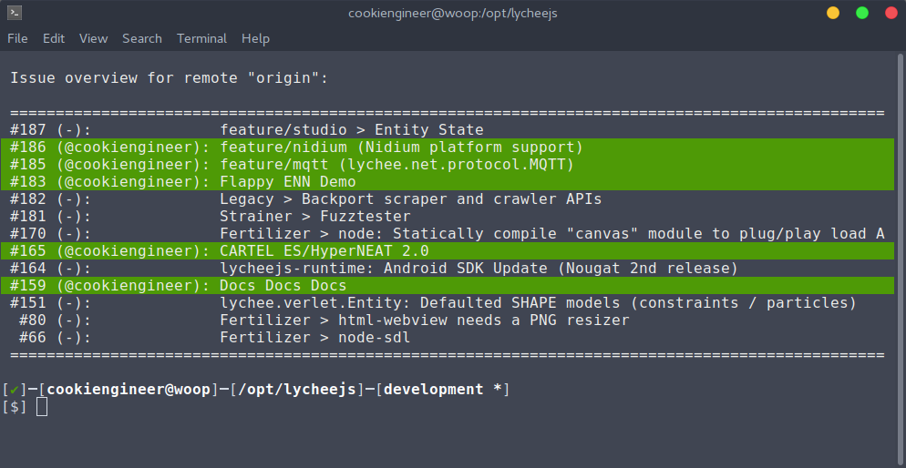

# git work

brought to you as libre software with joy and pride by [Artificial Engineering](http://artificial.engineering).

Support our libre Bot Cloud via BTC [1CamMuvrFU1QAMebPoDsL3JrioVDoxezY2](bitcoin:1CamMuvrFU1QAMebPoDsL3JrioVDoxezY2?amount=0.5&label=lycheeJS%20Support).


## Overview

`git work` is an extension to the git command line tool that
allows an offline-ready integration with GitHub issues.

It is compatible with all GitHub Issue features and allows
filtering them by `remote`, `milestone`, `assignee`, or `label`.

GitHub allows the auto-closing issues via commit message.
For example, a commit message containing `Fixes issue #1337`
allows closing an issue.

With above closing mechanism and `git work` as a CLI tool
you never have to visit the GitHub web interface again :)




## Requirements

- `node` (node.js) with ES2016 support


## Installation

The installation process is quite simple. There are two
ways to do it:

1. Download the [build/git-work.js](./build/git-work.js) file to
   `/usr/bin/git-work` and make it executable.

2. Install the `git-work` package via NPM globally.
   Don't worry, this project has zero dependencies.


```bash
sudo npm install -g git-work;
```


# Configuration

If git is configured with an email `awesome@hard.works`, all
issue with the assignee `awesome` will be assumed to be you.

If that causes you trouble, you can override the defaulted
filter with the supported filter flag syntax:

```bash
git work show --assignee="not-awesome";
```


**Offline Cache and GitHub Token**:

Important Note: The GitHub API has rate limits, if you call
`git work sync` manually too often, you probably will get blocked.

This can be avoided using a [Personal Access Token](https://github.com/settings/tokens)
with `repo` rights.

```bash
cd /path/to/repository;

mkdir .github;
echo "YOUR-PERSONAL-ACCESS-TOKEN" > .github/TOKEN;
```

The `git work` cache is per-repository (and per-remote, which
means it will create a `.github` folder and a `.github/ISSUES`
cache file in your repo.

These are the files that influence the `git work` behaviour:

- `.github/ISSUES` contains the JSON cache for all issues.
- `.github/TOKEN` (optionally) contains the Personal Access Token.


## Usage

The usage syntax is super-simple:

```bash
git work sync;     # Sync all open issues
git work show;     # List all open issues
git work show 123; # Show issue #123

# Below are some filter examples
git work show --remote="upstream";
git work show --milestone="2017-Q2";

git work show --label="bug-report";
git work show --assignee="cookiengineer";
```


## License

`git work` is (c) 2016-2017 by [Cookie Engineer](https://github.com/cookiengineer)
and released under MIT / Expat license. For further details take a look at the
[LICENSE.txt](LICENSE.txt) file.

